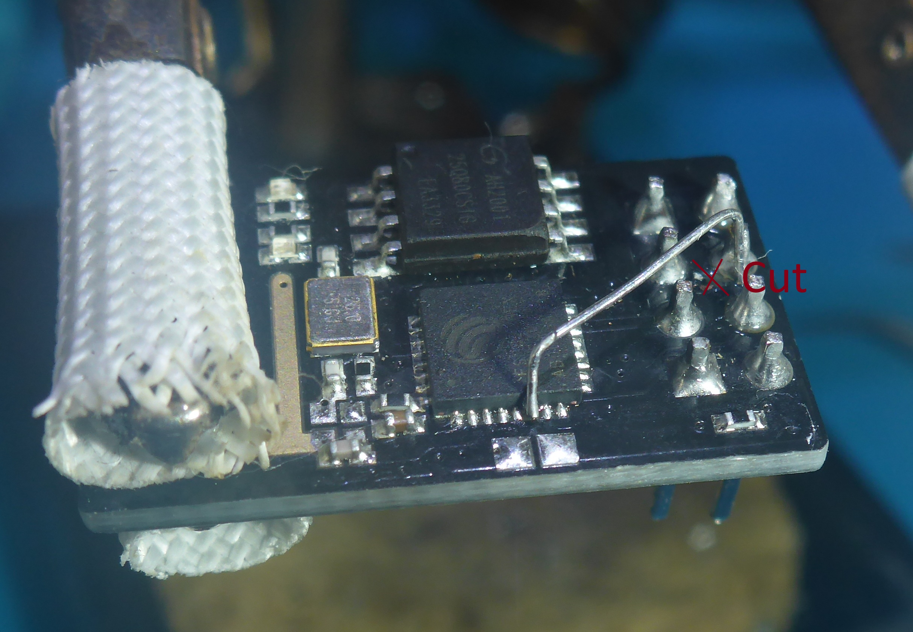

# ESP-01 ADC Mod

> ESP-01 is **the only ESP module with DIP pins**, one of the most compact ESP boards, exposing just **4 accessible pins** (with some limitations). However, the **lack of an accessible ADC** severely limits its use in autonomous or analog projects.
> 
> The **ESP8266 is significantly more powerful than Arduino Uno/Nano**, with built-in Wi-Fi and vastly more memory, and there is a **huge number of ready-made modules** designed specifically for it.

This repository documents a simple hardware modification for ESP-01 modules that enables ADC usage.


---

## What Was Modified

- Original **RESET routing** was intentionally removed, as rarely needed

- A thin wire was soldered directly to the **ESP-01 RST pin**

- The wire was routed to the **ESP8266 chip ADC pin pad**

- When the wire end was fully aligned with the pad, it was pressed with the soldering iron

- Nearby capacitor was temporarily removed for easier access

**All soldering was done using a regular soldering iron, lenses, and three hands—no hot air, no microscope.**



---

## Result

- Fully working **ADC (ex-RST) pin**

- Optional ADC access for **battery voltage monitoring**

- ESP-01 becomes suitable for:
  
  - Battery-powered devices
  
  - Ready for reading **any analog sensors**
  
  - Autonomous IoT nodes

---

## Notes

- Secure wires after soldering (glue or coating recommended)

- Verify connections with a multimeter before powering up

This modification allows reusing ESP-01 modules in modern low-power and analog projects instead of replacing them with larger ESP-12 or ESP32 boards.

---

---

## 🔌 ESP8266 ADC voltage divider cheat-sheet

**ESP8266 ADC range: 0…1.0 V**  
Anything above **must** be scaled down with a resistor divider.

### 📐 Divider formula

```
Vadc = Vin × R2 / (R1 + R2)
```

---

### 📊 Common voltage dividers (standard resistors)

| Vin max | R1 (top) | R2 (bottom) | Vadc @ Vin | Notes                   |
| ------- | -------- | ----------- | ---------- | ----------------------- |
| 1.0 V   | —        | —           | 1.0 V      | No divider needed       |
| 3.3 V   | 22 kΩ    | 10 kΩ       | ≈ 1.03 V   | OK in practice          |
| 5.0 V   | 39 kΩ    | 10 kΩ       | ≈ 1.02 V   | Classic                 |
| 12 V    | 100 kΩ   | 10 kΩ       | ≈ 1.09 V   | Borderline              |
| 12 V    | 110 kΩ   | 10 kΩ       | ≈ 1.00 V   | Safer choice            |
| 15 V    | 150 kΩ   | 10 kΩ       | ≈ 0.94 V   | Safe, slight range loss |

👉 **R2 = 10 kΩ** chosen as a convenient baseline  
👉 Values are from common E12/E24 series

---

### 🔧 ASCII schematic

```
 Vin ── R1 ──┬── ADC (ESP8266)
             |
             R2
             |
            GND
```

**Optional (recommended for noisy sources):**

```
ADC ── 100 nF ── GND
```

---

### ⚠️ Notes (worth keeping)

- ESP8266 ADC is **not 3.3 V tolerant**

- Keep divider impedance reasonable  
  (total resistance ≈ 50–200 kΩ works well)

- Avoid mega-ohm dividers — ADC input gets unstable

- For battery monitoring, this setup is more than accurate enough

---

## ESP-01 ADC Hack — Minimal, non-blocking, WDT-friendly

```cpp
/*
  ESP-01 ADC Hack — read analog signals on the module that didn’t deserve an ADC
  Non-blocking, WDT-friendly, EMA smoothing, with a pinch of despair
  2026 — still soldering a wire directly to the crystal. Beauty!

  Author: the human who burned 3 modules so you don’t burn the fourth
*/

const float EMA_ALPHA = 0.15f;    // smoothing: 0.1=very smooth, 0.3=jerky like post-deadline nerves
float adcEMA = 0.0f;              // EMA accumulator, initially garbage (like my life before coffee)

// Voltage divider — classic 10k+10k because resistors are everywhere
const float R1 = 10000.0f;        // top leg (to Vin or 3.3V)
const float R2 = 10000.0f;        // bottom leg (to GND, NTC, or photoresistor)

const float ADC_MAX  = 1024.0f;   // 10-bit ADC
const float ADC_VREF = 1.0f;      // ESP8266 ADC reference voltage (TOUT pin)

// Sampling interval
const uint32_t SAMPLE_INTERVAL_MS = 500;
uint32_t lastSample = 0;
bool firstADC = true;

/* ADC function */
void readADC() {
  int raw = analogRead(A0);

  if (firstADC) {
    adcEMA = (float)raw;
    firstADC = false;
  } else {
    adcEMA = EMA_ALPHA * raw + (1.0f - EMA_ALPHA) * adcEMA; // EMA smoothing
  }

  float vPin = adcEMA / ADC_MAX * ADC_VREF;
  float vIn  = vPin * (R1 + R2) / R2;

  // NTC 10k, β=3950 — classic
  float rNTC = R1 * vPin / (ADC_VREF - vPin + 0.0001f);
  if (rNTC < 100.0f) rNTC = 100.0f;  // protect from disconnected sensor
  float tempC = 1.0f / (1.0f/298.15f + log(rNTC / 10000.0f)/3950.0f) - 273.15f;

  Serial.printf("ADC:%4d | EMA:%6.1f | Vin:%5.2f V | NTC:%6.1f°C | rNTC:%7.0f Ω\n",
                raw, adcEMA, vIn, tempC, rNTC);
}

void setup() {
  Serial.begin(115200);
  delay(300); // let Serial settle
  Serial.println("\n=== ESP-01 ADC FrankenHack v1.2 ===");
  firstADC = true;
}

void loop() {
  uint32_t now = millis();

  if (now - lastSample >= SAMPLE_INTERVAL_MS) {
    lastSample = now;
    readADC();
  }

  // skip the brakes (delay); feed the Watch Dogs Cerbers with yield();))
  yield(); // non-blocking, WDT-friendly, Cerbers stay happy
}
```

---

### 🔹 Features

* Fully **non-blocking**, **WDT-safe** (`yield()` instead of `delay()`)
* EMA filter for smooth ADC readings
* Voltage divider for battery, NTC, photoresistors
* Examples: battery voltage, NTC thermistor, LDR
* Ready for **deep sleep** and parallel Wi-Fi / MQTT / Telegram logic

---


