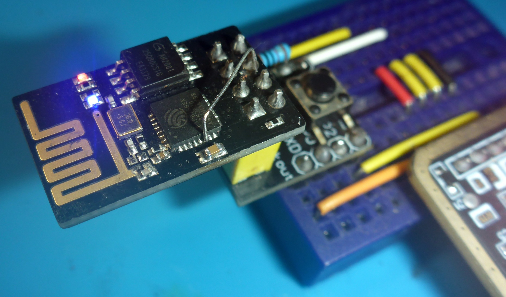

# ESP-01 ADC Mod

Вот аккуратно отформатированный и логически цельный вариант, без «разрыва» предложения:

> ESP-01 is **the only ESP module with DIP pins**, one of the most compact ESP boards, with **4 accessible pins** (with some limitations). However, the **lack of ADC** strongly limits its use in autonomous or analog projects.
> 
> The **ESP8266 is significantly more powerful than Arduino Uno/Nano**, with built-in Wi-Fi and vastly more memory, and there is a **huge number of ready-made modules** designed specifically for it.

This repository documents a simple hardware modification for ESP-01 modules that enables ADC usage.



---

## What Was Modified

- Original **RESET routing** was intentionally removed, as rarely needed

- A thin wire was soldered directly to the **ESP-01 RST pin**

- The wire was routed to the **ESP8266 chip ADC pin pad**

- When the wire end was fully aligned with the pad, it was pressed with the soldering iron

- Nearby capacitor was temporarily removed for easier access

**All soldering was done using a regular soldering iron, lenses, and three hands—no hot air, no microscope.**


---

## Result

- Fully working **ADC (ex-RST) pin**

- Optional ADC access for **battery voltage monitoring**

- ESP-01 becomes suitable for:
  
  - Battery-powered devices
  
  - Ready for reading **any analog sensors**
  
  - Autonomous IoT nodes

---

## Notes

- Secure wires after soldering (glue or coating recommended)

- Verify connections with a multimeter before powering up

This modification allows reusing ESP-01 modules in modern low-power and analog projects instead of replacing them with larger ESP-12 or ESP32 boards.

---

---

## 🔌 ESP8266 ADC voltage divider cheat-sheet

**ESP8266 ADC range: 0…1.0 V**  
Anything above **must** be scaled down with a resistor divider.

### 📐 Divider formula

```
Vadc = Vin × R2 / (R1 + R2)
```

---

### 📊 Common voltage dividers (standard resistors)

| Vin max | R1 (top) | R2 (bottom) | Vadc @ Vin | Notes                   |
| ------- | -------- | ----------- | ---------- | ----------------------- |
| 1.0 V   | —        | —           | 1.0 V      | No divider needed       |
| 3.3 V   | 22 kΩ    | 10 kΩ       | ≈ 1.03 V   | OK in practice          |
| 5.0 V   | 39 kΩ    | 10 kΩ       | ≈ 1.02 V   | Classic                 |
| 12 V    | 100 kΩ   | 10 kΩ       | ≈ 1.09 V   | Borderline              |
| 12 V    | 110 kΩ   | 10 kΩ       | ≈ 1.00 V   | Safer choice            |
| 15 V    | 150 kΩ   | 10 kΩ       | ≈ 0.94 V   | Safe, slight range loss |

👉 **R2 = 10 kΩ** chosen as a convenient baseline  
👉 Values are from common E12/E24 series

---

### 🔧 ASCII schematic

```
 Vin ── R1 ──┬── ADC (ESP8266)
             |
             R2
             |
            GND
```

**Optional (recommended for noisy sources):**

```
ADC ── 100 nF ── GND
```

---

### ⚠️ Notes (worth keeping)

- ESP8266 ADC is **not 3.3 V tolerant**

- Keep divider impedance reasonable  
  (total resistance ≈ 50–200 kΩ works well)

- Avoid mega-ohm dividers — ADC input gets unstable

- For battery monitoring, this setup is more than accurate enough

---
